# Snapshots

> A quick glimpse of UI implementation of XPT extension. 

`Note:` This is only a wireframe; the final product may differ. 

<!-- tabs:start -->

#### **Landing Page**

`Landing:`

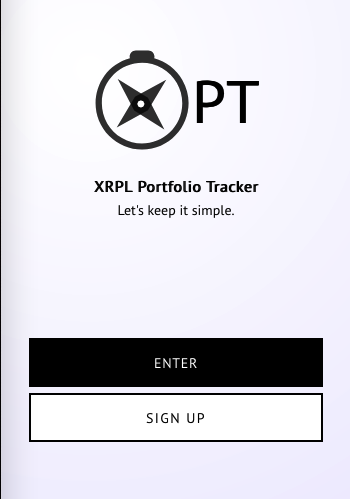

`Sign Up:`

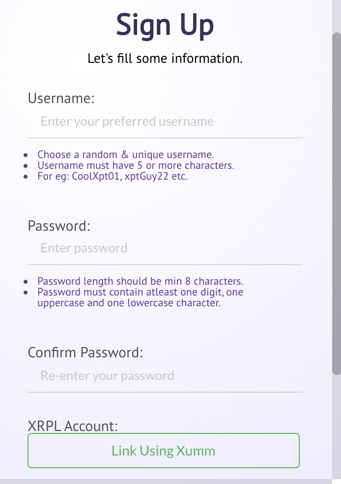

#### **Home & Account**

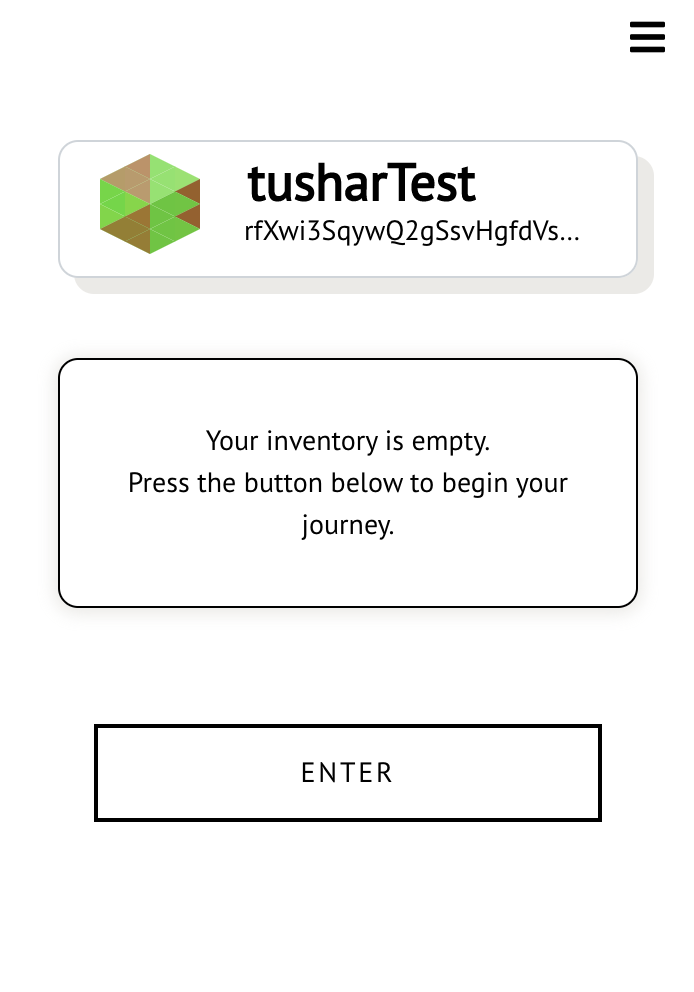
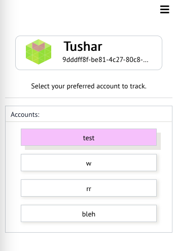

`Track:`

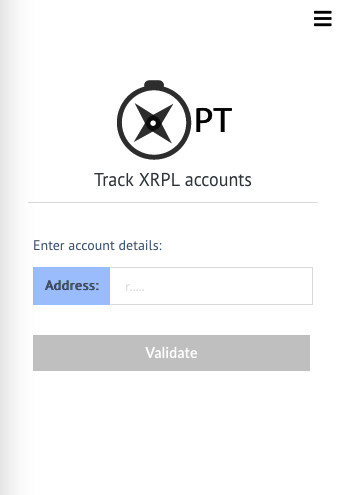

`Navbar:`

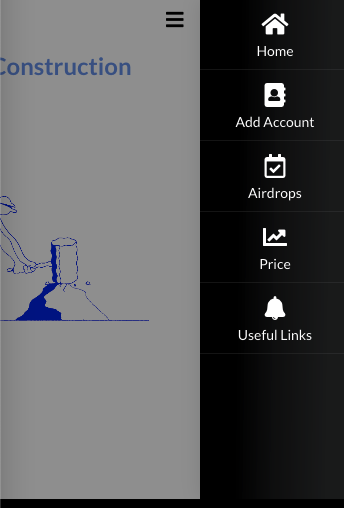

`Account Details:`

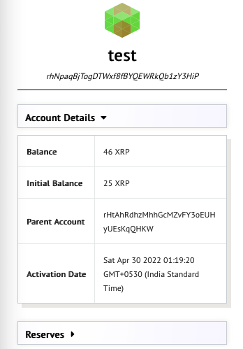

#### **AD Calendar**

`Airdrop List:`

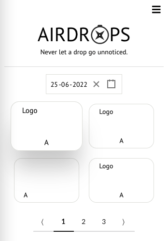
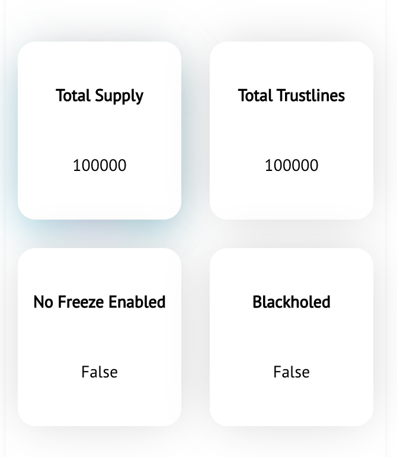
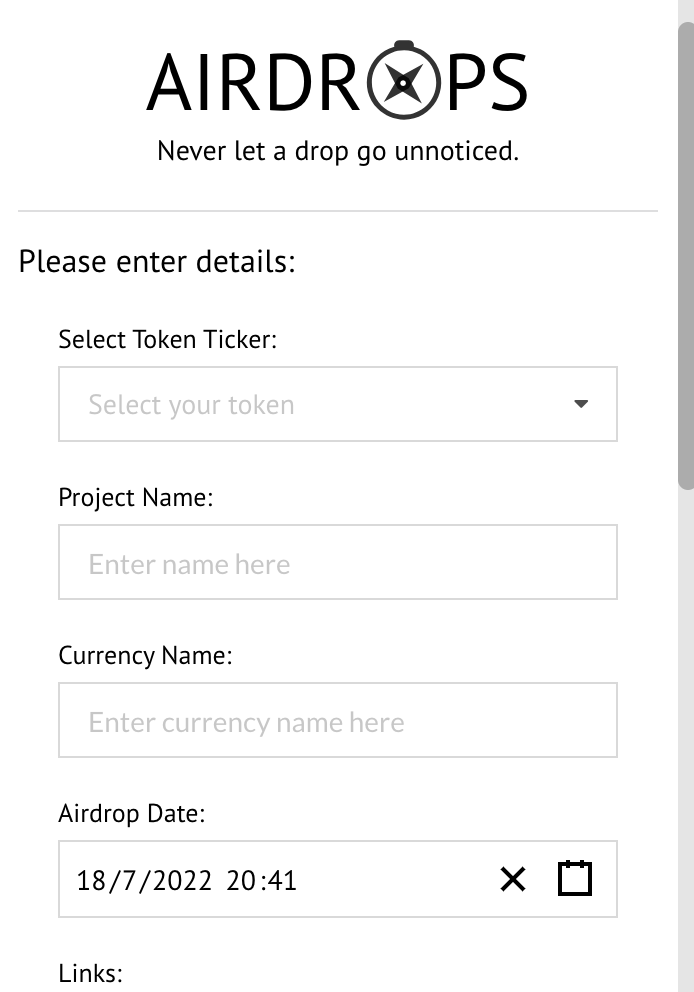
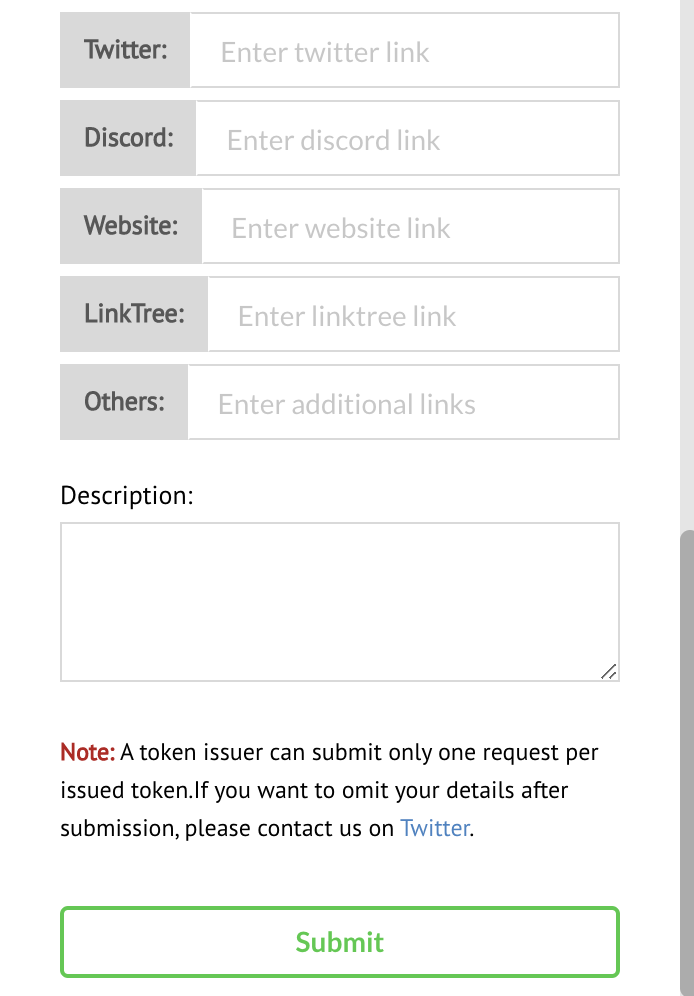

### **XRP Details**

`XRP Live Tracking:`

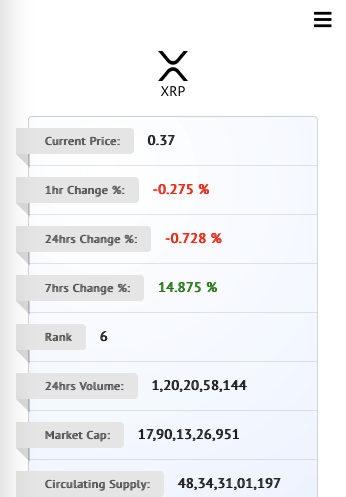

<!-- tabs:end -->

