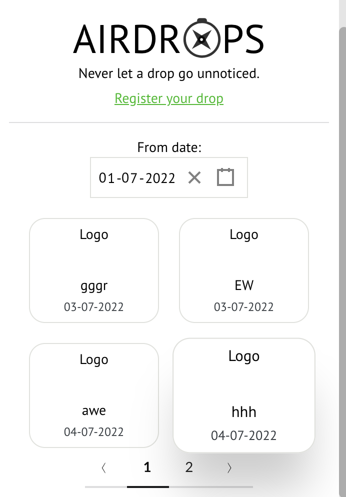

# Snapshots

> A quick glimpse of UI implementation of XPT extension. 

`Note:` This is only a wireframe; the final product may differ. 

<!-- tabs:start -->

#### **Landing Page**

`Landing:`

`Sign Up:`

#### **Home & Account**

`Track:`

`Navbar:`

`Account Details:`

#### **AD Calendar**

`Airdrop List:`

### **XRP Details**

`XRP Live Tracking:`

<!-- tabs:end -->

