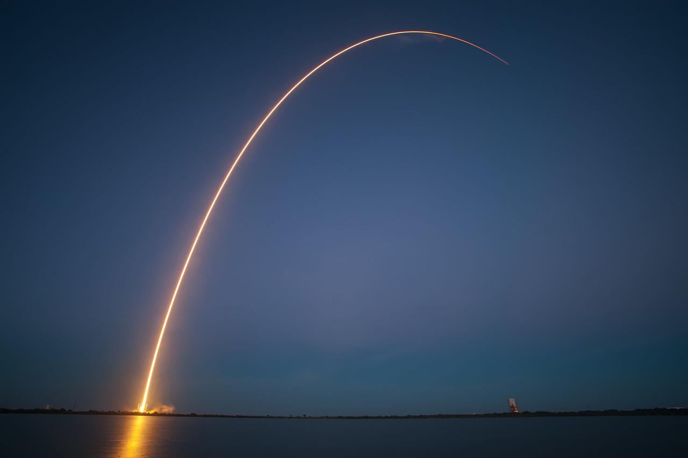

# Timeline

## `Phase 1:` Brainstorming & Initialisation [July] :hourglass:

During this phase, I'll begin working on inititalsing project's core and put my present ideas into practise. Will have discussions with other developers to get their valuable feedback and to determine the project's viability and use.

Furthermore, I'll work on developing backend APIs for getting user information, getting airdrop details, registering for airdrop calendars, etc.

This stage will also see the creation of the application's basic design and layout. 

## `Phase 2:` Coding & Implementation [Aug]

The milestones and logics will be defined during this stage of the project. I'll work on incorporating user flow and calendar APIs with the front end user interface.

At this stage, work flows such as the previous five transactions, account portfolio, helpful projects and connections, and XRP live updates will be developed and refined. 

## `Phase 3:` Login and User management [Sept]

This is the most important part of the project; security is my top priority. I'll using one-way hashing to store user passwords, meaning that even if a database is compromised, retrieving user keys will be an extremely difficult task. However, this also means that once a user loses their keys, they will no longer have access to their accounts. I will be using [bcrypt](https://github.com/kelektiv/node.bcrypt.js) with 12 rounds of salt for better security. You can read more about one-way hashing by clicking [here](https://en.citizendium.org/wiki/One-way_encryption).

## `Phase 4:` Finalisation [Oct]

This phase will involve testing the entire workflow and distributing the beta version of the product to a select group of users.
Incorporating feedback, project partnerships, and project marketing will also be explored. 

## `Phase 5:` Launch [Oct]

After completion of all the previous phases we'll be all set for launch. The extension will be listed on chrome web-store for downloads.

Thank you for taking the time to read this. I will do my best to stick to the timeline. I hope you've a wonderful day and `lets keep it simple.`

